 

---

### > whoami

**MD Al Araf Hossain**  
🎓 CSE Student @ **International Islamic University Chittagong**  
💻 Full-Stack Developer • 🐍 Python Learner • 🤖 ML/AI Enthusiast

> **I don't just learn technologies. I build with them.**

---

## ⚡ What I'm Building Right Now

<table>
<tr>
<td width="33%" align="center">

### 🧠 ENGINEERING
**Core → Strong**

DSA  
DBMS  
Operating Systems  
Software Engineering

</td>
<td width="33%" align="center">

### 🌐 FULL-STACK
**Idea → Product**

React  
Django  
REST APIs  
Databases  
Firebase

</td>
<td width="33%" align="center">

### 🤖 AI / ML
**Python → Intelligence**

Python  
Data  
Model Training  
Automation  
AI Experiments

</td>
</tr>
</table>

---

## 🛸 Featured Builds

<table>
<tr>
<td width="50%" valign="top">

### 🎫 IIUC EventEra

**Campus events → one platform.**

A full-stack event management system built around real campus workflows.

**01** 🔐 Authentication  
**02** 🎟️ Registration  
**03** 💳 Payment verification  
**04** 📄 PDF + QR passes  
**05** 🛡️ Admin control center  
**06** 📡 QR scanning

<a href="https://github.com/Araf1011/IIUC-EventEra">🚀 OPEN REPOSITORY</a>

</td>
<td width="50%" valign="top">

### 👕 Jersey Lagbe

**Jerseys → made simple.**

A web project focused on building a practical jersey shopping experience with a clean product-oriented interface.

**01** 🛍️ Product browsing  
**02** 👕 Jersey-focused catalog  
**03** 🎨 Clean UI  
**04** 📱 Responsive experience  
**05** 🧩 Frontend development  
**06** 🚀 Practical project build

<a href="https://github.com/Araf1011/Jersey-Lagbe-">🚀 OPEN REPOSITORY</a>

</td>
</tr>
</table>

---

## 🧰 Tech Arsenal

  

---

## 🧪 My Developer Loop

~~~text
       ┌──────────┐
       │  IDEA 💡 │
       └────┬─────┘
            ↓
       ┌──────────┐
       │ BUILD 🛠 │
       └────┬─────┘
            ↓
       ┌──────────┐
       │ BREAK 💥 │
       └────┬─────┘
            ↓
       ┌──────────┐
       │ DEBUG 🧠 │
       └────┬─────┘
            ↓
       ┌──────────┐
       │ IMPROVE ⚡│
       └────┬─────┘
            ↓
       ┌──────────┐
       │ SHIP 🚀  │
       └────┬─────┘
            │
            └──────────────→ REPEAT
~~~

---

## 📡 GitHub Command Center

### 📊 GitHub Statistics

### 🧠 Top Languages

  

### 🏆 GitHub Trophies

---

## 📈 Activity Wall

---

## 🐍 Watch The Contributions Move

---

## 🎯 2026 → 2027

| NOW | NEXT | LATER |
|:---:|:---:|:---:|
| 🧩 DSA + CS Fundamentals | 🌐 Production Backend | 🤖 ML / AI Systems |
| 🐍 Python + Django | ⚛️ Advanced React | ☁️ Cloud + DevOps |
| 🗄️ Databases + APIs | 🏗️ System Design | 🚀 Real Products |

---

## 🖥️ Terminal

~~~bash
$ ./araf --status

[██████████████████░░] 90%  learning
[███████████████░░░░░] 75%  building
[████████████░░░░░░░░] 60%  debugging
[██████████░░░░░░░░░░] 50%  shipping

> status: ONLINE
> mission: BUILD SOMETHING USEFUL
> next: KEEP GOING 🚀
~~~

---

### 🤝 If you're building something interesting, let's connect.

  

**⚡ BUILD LESS TUTORIALS. BUILD MORE SOFTWARE.**

